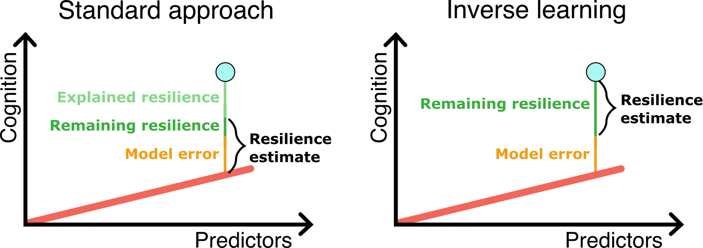

# Inverse learning for estimating latent constructs such as cognitive resilience

In this repository, you will find the code to our preprint titled "Rethinking the residual approach: Leveraging machine learning to operationalize cognitive resilience in Alzheimer’s disease". It has been submitted for publication in a peer-reviewed journal.

A pre-print will be published shortly.

### Content

- `src/`: Contains all the source code.
    - `example.ipynb`: An examplary run of the framework highlighting how the code can be used.
    - `expectation_elasitnec/`: Elasitc net implementation that can be used as the expectation model.
    - `expectation_elasitnec/`: xgboostimplementation that can be used as the expectation model.
    - `standard_approach/`: A linear regression used for the standard approach and when modelling the expectation using a linear model.
    - `simulated_data/`: All the scripts used for simulating the data and running the experiments presented in the manuscript.
    - `plotting.py`: Functions used for creating the plots.
    - `utils.py`: Utility functions used in the other scripts.

### Dependencies
All dependencies are listed in the 'environment.yml' file and can be installed using conda.
